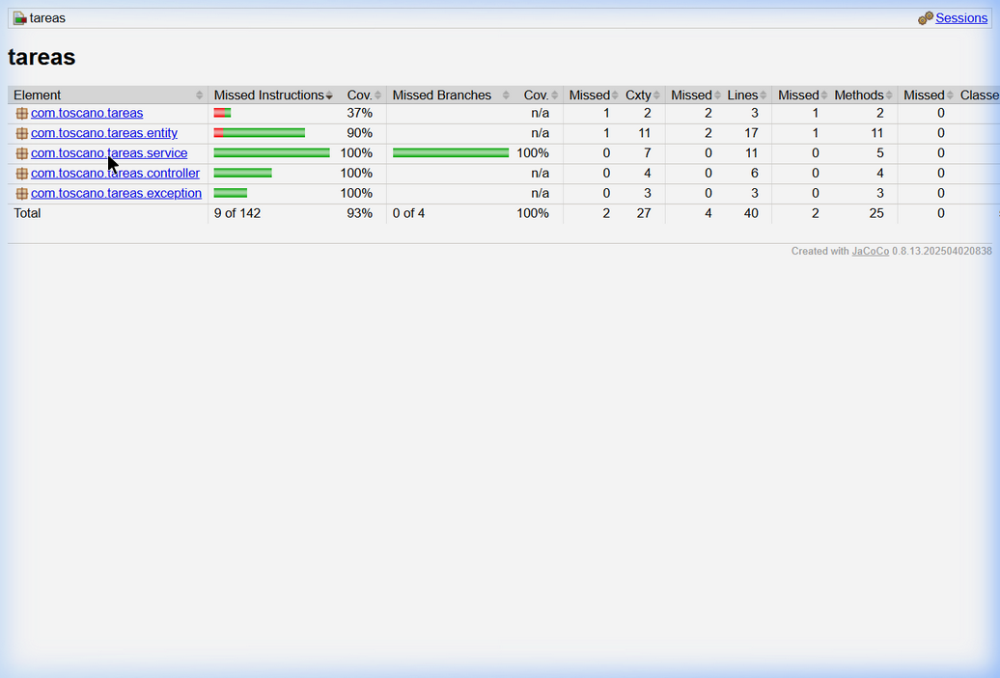

# Toscano — Post 1 · Unidad 10

## Suite de Pruebas con JUnit 5, Mockito y JaCoCo

Aplicación Spring Boot de **gestión de tareas** con suite de pruebas automatizadas que cubre las capas de servicio, controlador y repositorio.

---

## Tecnologías

| Tecnología | Versión |
|---|---|
| Java | 17+ |
| Spring Boot | 3.4.5 |
| JUnit 5 | 5.10.x |
| Mockito | 5.14.x |
| H2 Database | En memoria |
| JaCoCo | 0.8.13 |
| Maven | 3.9.x |

---

## Estructura del Proyecto

```
src/
├── main/java/com/toscano/tareas/
│   ├── TareasApplication.java            ← Clase principal Spring Boot
│   ├── entity/
│   │   └── Tarea.java                    ← Entidad JPA (@Entity)
│   ├── repository/
│   │   └── TareaRepository.java          ← Interfaz JpaRepository
│   ├── service/
│   │   └── TareaService.java             ← Lógica de negocio
│   ├── controller/
│   │   └── TareaController.java          ← REST Controller
│   └── exception/
│       └── GlobalExceptionHandler.java   ← @RestControllerAdvice
├── main/resources/
│   └── application.properties            ← Configuración H2 en memoria
└── test/java/com/toscano/tareas/
    ├── service/
    │   └── TareaServiceTest.java         ← Pruebas unitarias (Mockito)
    ├── controller/
    │   └── TareaControllerTest.java      ← Pruebas web (@WebMvcTest)
    └── repository/
        └── TareaRepositoryTest.java      ← Pruebas de BD (@DataJpaTest)
```

---

## Configuración de la Base de Datos (H2 en memoria)

La aplicación utiliza **H2 en memoria** tanto para ejecución como para pruebas. La configuración se encuentra en `src/main/resources/application.properties`:

```properties
spring.datasource.url=jdbc:h2:mem:tareasdb
spring.datasource.driver-class-name=org.h2.Driver
spring.jpa.hibernate.ddl-auto=create-drop
```

Para `@DataJpaTest`, Spring Boot auto-configura H2 en memoria y revierte los cambios entre tests automáticamente.

---

## Ejecución de las Pruebas

### Ejecutar todos los tests

```bash
mvn clean test
```

### Ejecutar tests individuales

```bash
# Solo pruebas unitarias del servicio
mvn test -Dtest=TareaServiceTest

# Solo pruebas del controlador
mvn test -Dtest=TareaControllerTest

# Solo pruebas del repositorio
mvn test -Dtest=TareaRepositoryTest
```

### Ejecutar tests + verificación de cobertura JaCoCo

```bash
mvn clean verify
```

Este comando ejecuta todos los tests, genera el reporte JaCoCo y verifica que la cobertura de líneas sea ≥ 70 %.

---

## Descripción de las Clases de Prueba

### 1. `TareaServiceTest` — Pruebas Unitarias con Mockito

Utiliza `@ExtendWith(MockitoExtension.class)` con `@Mock` para el repositorio y `@InjectMocks` para el servicio.

| Test | Descripción |
|---|---|
| `crear_conTituloValido_guardaYRetorna` | Verifica que `crear()` guarda y retorna la tarea cuando el título es válido. Usa `when/thenReturn` y `verify`. |
| `crear_conTituloVacio_lanzaIllegalArgumentException` | Verifica que un título en blanco lanza `IllegalArgumentException`. Confirma con `verify(repo, never()).save(any())`. |
| `crear_conTituloNulo_lanzaIllegalArgumentException` | Verifica que un título `null` lanza `IllegalArgumentException`. |
| `buscarPorId_noExiste_lanzaEntityNotFoundException` | Verifica que buscar un ID inexistente lanza `EntityNotFoundException`. |
| `buscarPorId_existe_retornaTarea` | Verifica que buscar un ID existente retorna la tarea correcta. |
| `completar_conIdExistente_marcaComoCompletada` | Verifica que `completar()` marca la tarea como completada y la persiste. |

### 2. `TareaControllerTest` — Pruebas de Integración Web (`@WebMvcTest`)

Utiliza `@WebMvcTest(TareaController.class)` con `MockMvc` y `@MockBean` para aislar la capa web.

| Test | Descripción |
|---|---|
| `get_tareaExiste_retorna200` | `GET /api/tareas/1` retorna 200 y el JSON de la tarea. |
| `get_noExiste_retorna404` | `GET /api/tareas/99` retorna 404 cuando la tarea no existe. |
| `post_conTareaValida_retorna201` | `POST /api/tareas` con JSON válido retorna 201 Created. |
| `post_conTituloVacio_retorna400` | `POST /api/tareas` con título vacío retorna 400 Bad Request. |
| `patch_completar_retorna200` | `PATCH /api/tareas/1/completar` retorna 200 con `completada: true`. |

### 3. `TareaRepositoryTest` — Pruebas de Integración BD (`@DataJpaTest`)

Utiliza `@DataJpaTest` con `TestEntityManager` y H2 en memoria. Los cambios se revierten automáticamente entre tests.

| Test | Descripción |
|---|---|
| `findByCompletada_false_retornaUnaTarea` | Verifica que `findByCompletada(false)` retorna exactamente 1 tarea con título "Pendiente". |
| `findByCompletada_true_retornaListaVacia` | Verifica que `findByCompletada(true)` retorna lista vacía cuando no hay tareas completadas. |

---

## Cobertura con JaCoCo

El plugin `jacoco-maven-plugin` está configurado con:

- **Goal `prepare-agent`**: Instrumenta las clases para recopilar datos de cobertura.
- **Goal `report`**: Genera el reporte HTML en `target/site/jacoco/index.html`.
- **Goal `check`**: Verifica que la cobertura de líneas sea ≥ 70 % (excluyendo `*Application.class` y `entity/**`).

### Reporte de Cobertura

El reporte se genera automáticamente al ejecutar `mvn clean verify` y se puede consultar en:

```
target/site/jacoco/index.html
```

### Captura del Reporte JaCoCo



**Resultados:**

| Paquete | Instrucciones | Branches | Líneas | Métodos |
|---|---|---|---|---|
| `com.toscano.tareas.service` | 100 % | 100 % | 100 % | 100 % |
| `com.toscano.tareas.controller` | 100 % | n/a | 100 % | 100 % |
| `com.toscano.tareas.exception` | 100 % | n/a | 100 % | 100 % |
| **Total (sin entity ni Application)** | **93 %** | **100 %** | **90 %** | **92 %** |

✅ **`mvn clean verify` finaliza sin errores** — cobertura ≥ 70 % verificada.

---

## Autor

**Andrés Toscano** — Ingeniería de Sistemas, UDES 2026
